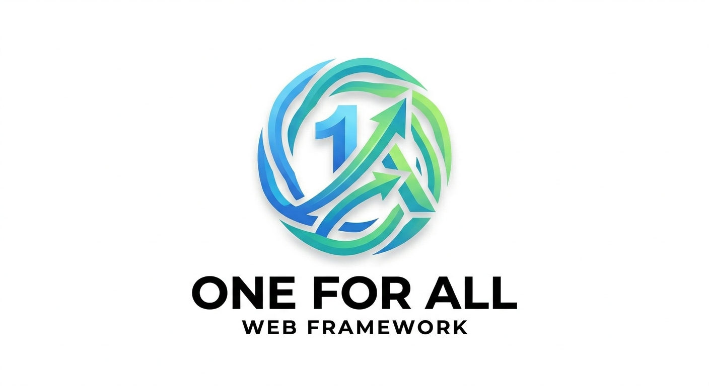

<p align="center">
  
</p>

# ⚡ One-For-All (OFA) Framework

[](https://www.ruby-lang.org/)
[](LICENSE)
[]()

**One-For-All (OFA)** is a premium, ultra-fast Ruby MVC framework designed for developers who value both high performance and modern aesthetics. Built on the powerful **Eks-Cent** engine and optimized with **Eksa Server**, OFA provides a production-ready foundation with a stunning "Glassmorphism" UI out of the box.

---

## ✨ Why One-For-All?

-   **💎 Premium Aesthetics**: Beautiful Glassmorphism design system included by default with smooth dark/light mode transitions.
-   **🚀 Blazing Fast**: Built on a modular Nio4r-powered engine for minimal overhead and instant boot times.
-   **📂 Multi-Database**: Seamlessly switch between SQLite, MySQL, MariaDB, and MongoDB Atlas.
-   **🛠️ Developer First**: A robust CLI (`ofa`) that handles everything from scaffolding to deployment.
-   **🔐 Enterprise Ready**: Built-in CSRF protection, secure session management, and input validation.
-   **🌐 Global Support**: Multi-language (I18n) support and SEO optimization ready.

---

## 🚀 Getting Started

### 1. Prerequisites
Ensure you have Ruby 3.0+ and Bundler installed on your system.

### 2. Installation
Clone the repository and install dependencies:
```bash
git clone https://github.com/ishikawauta/one-for-all-framework.git
cd one-for-all-framework
bundle install
```

### 3. Quick Initialization
Initialize your project environment and database:
```bash
./ofa init
```
*The interactive wizard will help you configure your database and cloud storage (Cloudinary).*

### 4. Run the Engine
Launch your development server:
```bash
./ofa run
```
Your app is now live at `http://localhost:3000` ⚡

---

## 🛠️ CLI Power Tools

The `ofa` CLI is your best friend. Use it to manage your entire application lifecycle:

| Command | Description |
| :--- | :--- |
| `ofa new NAME` | Create a brand new project from scratch. |
| `ofa g controller Name` | Generate a RESTful controller. |
| `ofa g model Name` | Generate a database model and migration. |
| `ofa db migrate` | Sync your database with the latest schema. |
| `ofa type [blog\|portfolio]` | Switch application mode instantly. |
| `ofa theme [dark\|light]` | Toggle between premium UI themes. |
| `ofa storage cloudinary` | Enable automated Cloudinary image hosting. |
| `ofa reset-password USR PWD`| Securely reset admin credentials. |

---

## 🏗️ Architecture

OFA follows a strict **MVC (Model-View-Controller)** pattern:

-   **Models**: Powered by **Sequel** for SQL and **Mongo Ruby Driver** for NoSQL.
-   **Views**: High-performance **ERB** templates with a modular design system.
-   **Controllers**: Lightweight logic handlers with built-in validation helpers.
-   **Middleware**: Custom authentication and session sliding expiration (8-hour default).

---

## 🚢 Deployment

One-For-All is optimized for modern cloud platforms:

-   **Railway / Heroku**: Uses the included `Procfile` for automatic detection.
-   **Docker**: A lightweight `Dockerfile` based on `ruby:3.2-slim` is provided.
-   **VPS**: Can be run behind Nginx/Apache using the `ofa run` command.

---

## 🤝 Contributing

We welcome contributions! Please feel free to submit Pull Requests or report issues on the [GitHub repository](https://github.com/ishikawauta/one-for-all-framework).

## 📄 License

This project is licensed under the **MIT License**. See the [LICENSE](LICENSE) file for details.